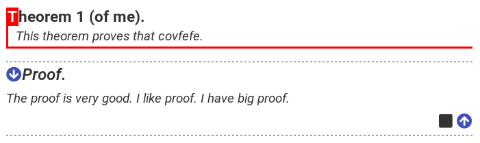
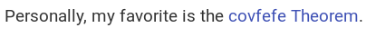
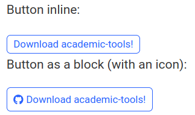
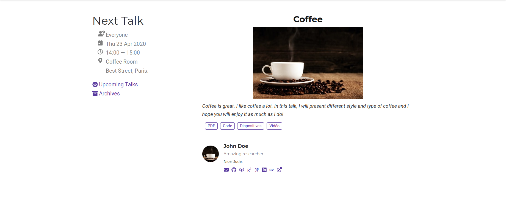

# Hugo Academic Tools

This is an add-on for the [`Academic`](https://github.com/gcushen/hugo-academic/) theme for the static site generator [Hugo](https://gohugo.io). This short package brings new widgets and shortcode:

- Widget Next Talk: Display the next talk, for a website dedicated to a seminar for example
- `Thm` shortcode: mimic `amsthm` latex package
- `button` shortcode: for a nice bootstrap-styled button


## Installation

Obviously, the [`Academic`](https://github.com/gcushen/hugo-academic/) theme is requiered.

### Download

1. Direct Download :
   - Download [the last version](https://github.com/Bertbk/academic-tools/archive/master.zip)
   - Extract and place `academic-tools` folder in your `themes` folder
2. Git submodule (**recommended**). At the root your folder, type the following command
    ```bash
    git submodule add https://github.com/Bertbk/academic-tools.git themes/academic-tools
    ```

### Configure

1. Add `"academic-tools"` as a theme in `config/_default/config.toml`. Place it after `"academic"` (order matters):
    ```toml
    #params.toml
    # Name of Academic theme folder in `themes/`.
    theme = ["academic", "academic-tools"]
    ```
2. Create (if not already done) a file in `assets/scss/custom.scss` and add this line inside
    ```scss
    @import "academic-tools";
    ```
3. For Next Talk widget: add [FontAwesome JS file](https://fontawesome.com/): in `/layouts/partials/custom_js.html` (create it if necessary), add the following line
```html
<script src="https://use.fontawesome.com/releases/v{{ site.Data.assets.css.fontAwesome.version}}/js/all.js"></script>
```


### Remarks

- To use `git submodule`, your folder must also be a git repo!
- Do not forget to commit/add `.gitmodules`
- If you have set SSH key then you can use `ssh` instead of `https`:
    ```bash
    git submodule add git@github.com:Bertbk/academic-tools.git themes/academic-tools
    ```
  You can modify the `.gitmodules` file accordingly. 
- If, in addition to SSH, your website is automatically build through Gitlab page. You might need to add your ssh key to Gitlab variable and mofidy your `.gitlab-ci`.

### Customization

If you know a little bit about the CSS then is it quite easy, you just have to override the `.scss` files (*e.g.*  `assets/scss/thm.scss`). If you do not know about CSS but want to change the colors, have a look anyway at `assets/scss/thm.scss` file and search for the colors, you will quickly understand how it works.

## Thm (shortcode)

The [`Academic`](https://github.com/gcushen/hugo-academic/) theme provides a [nice layout (=design) for documentation](https://sourcethemes.com/academic/docs/writing-markdown-latex/). The math expression can be written mostly as in a basic LaTeX file thanks to MathJax (just set `math = true` in the frontmatter of your `.md` file). Some features were however missing for a math course, especially the "AMS Theorem environment" of LaTeX.

This is the purpose of this small "theme".

### Features

This "theme" contains [Hugo shortcodes](https://gohugo.io/content-management/shortcodes/#readout) that mimic the LaTeX AMS Theorem environment. A shortcode is a portion of code that `Hugo` will escape from the Markdown, making it possible to call external functions inside the Markdown. It features

- Customizable design
- Different type: Theorem, Proposition, Lemma, Corollary, Definition
- Theorem naming
- Cross reference
- Multi languages
- Proof environment
- Auto numbering (using CSS)

### Example

#### Thm blocks

```md

This theorem proves that covfefe.


The proof is very good. I like proof. I have big proof.

```

leads to this




You can change `type="theorem"` by `proposition`, `lemma`, `corollary` or `definition`.

#### Cross reference

A "theorem" can moreover be referenced using `thm/ref` using three different ways:

1. **Inline implicit** (order of arguments matters) :
  ```md
  Personally, my favorite is the .
  ```
2. **Inline explicit**  (order of arguments does not matter!):
  ```md
  Personally, my favorite is the .
  ```
3. **Environment**:
  ```md
  Personally, my favorite is the covfefe Theorem.
  ```

The result being the following:



If the theorem (or definition or...) is on a different page (say `intro.md`), you can use the `page` option. In that case, the options parameters must be explicit, either inline
```hugo
 
```
or in a block environment
```hugo
 
 covfefe Theorem
 
```

#### Remark

As you notice and contrary to LaTeX, the cross reference do not provide the number of the theorem. This is a little bit complicated as the numbering is done through CSS counter and I believe it is not necessary. However, if you are interested in, we can discuss about it.

## Shortcodes

### Div

Create an HTML `div` tag with `id`, `class`, `style` of your choice:
```hugo

loremp ipsum

```

### JS

Add a `script` tag linking to `src` javascript file:
```hugo

```

### Button

For a short text, this shortcode can be inline (note the trailing slash) or as a block to insert (for example) icons:
```hugo
Button inline:

Button as a block (with an icon):

<i class="fab fa-github"></i> Download academic-tools!

```
This will be displayed as:



Other options are also available:
- `src`: path to a link
- `title`: text displayed in the button. Should be left empty if used as a block environment
- `type`: correspond to [Bootstrap predefined button styles](https://getbootstrap.com/docs/4.0/components/buttons/), by default `type=outline-primary`
- `id`: add a HTML id to the button
- `class`: add custom class name to the button

To center a button, it can for example be combined with a ``.

## Widgets

### Next Talk

You can see an example of it on the [website of infomath](https://infomath.pages.math.cnrs.fr/).

- The content of the widget is displayed when no talk are programmed
- No new meta-data are used
- The category of the talk is displayed on the menu on the left



Credit: Photo of the Coffee by [Mike Kenneally](https://unsplash.com/photos/tNALoIZhqVM) on Unsplash